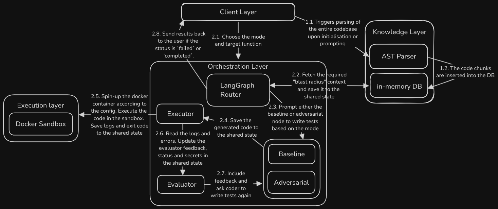

# Sunder

An agentic zero-trust sandbox testing framework for enterprise codebases. 
 


## Overview
Sunder operates in two sequential phases to guarantee deep logic penetration without being blocked by surface-level authentication or state requirements. It utilizes a Baseline Mode for state seeding and an Adversarial Mode for chaos fuzzing and logic assertions.
 
### Key Features:
Sunder was built to prioritize comprehensive test coverage, absolute host protection, and language agnosticism without exposing production environments to LLM hallucinations.

* **Zero-Trust Copy-on-Run Architecture:** Mounts host codebases strictly as Read-Only (`ro`) and uses an in-memory tar stream to extract files into an ephemeral container workspace. This guarantees host protection while mimicking a physical project tree.
* **Relational AST Retrieval (Blast-Radius Context):** Abandons traditional vector search in favor of Tree-sitter AST parsing and an in-memory SQLite database. This instantly maps exact call graphs, providing the LLM with the Target function, its Children (for accurate mocking), and its Parents (for input mimicry).
* **Two-Phase State Seeding:** Overcomes surface-level authentication blockers. A Baseline Phase explicitly generates happy-path tests along with setup code to capture required state (e.g., valid JWTs, mock database IDs) before injecting them into the Adversarial Phase for deep logic fuzzing.
* **Evaluator-Optimizer Loop:** Prevents context-window bloat and endless hallucination loops. A dedicated Evaluator node intercepts massive, raw Docker stack traces from failed runs and distills them into concise, actionable feedback for the Coder node.
* **Sandbox Config:** Enforces default architectural containment (`network_mode="none"`), requiring explicit human opt-in via the TUI to configure resource limits (RAM, CPU, execution timeouts), inject environment variables, or allow external API routing.  

## High-Level Architecture
 


> For a detailed breakdown of the execution flow, component responsibilities, and architecture patterns, please read [ARCHITECTURE.md](docs/ARCHITECTURE.md).
 
## Execution Flow
 
1.  **State Seeding:** The user defines a target function. The Knowledge Layer retrieves the context, and the Baseline Agent writes a "Happy Path" test. Upon a clean exit, the Evaluator extracts mock IDs and valid JWTs to save to the Environment State.
2.  **Adversarial Attack:** The Orchestrator injects the seeded state. The Adversary Agent studies the Parent context (usage patterns) and weaponizes it to fuzz the target with mutated inputs.
3.  **Isolated Execution:** The Sandbox runs the payload under specified constraints.
4.  **Evaluation:** The Evaluator declares a vulnerability if a hard crash (500/OOM) or silent logic flaw (AssertionError) occurs. Otherwise, it loops back to generate a new attack vector until the retry limit is reached.

## Project Structure

```
sunder/
├── src/
│   └── sunder/
│       ├── schema.py                   # Pydantic models for state management
│       ├── client/                     # TUI and UX components
│       │   ├── app.py                  # Main Textual application
│       │   ├── config_panel.py         # Sandbox configuration UI
│       │   ├── credentials_modal.py    
│       │   ├── dashboard.py            # Telemetry and reporting
│       │   ├── hitl_search.py          # Target function search
│       │   └── model_picker.py         # LLM selection modal
│       ├── execution/                  # Docker sandbox layer
│       │   ├── bootstrapper.py         # Docker environment setup
│       │   └── sandbox.py              # Container execution logic
│       ├── knowledge/                  # AST parsing and retrieval
│       │   ├── context_manager.py  
│       │   ├── database.py             # SQLite AST storage
│       │   ├── ingestion.py            # Tree-sitter parsing
│       │   ├── retrieval.py            # Context fetching
│       │   └── queries/                # Language-specific AST queries
│       │       ├── python/
│       │       ├── typescript/
│       │       ├── rust/
│       │       └── ... (20+ language directories)
│       └── orchestration/              # LangGraph agent logic
│           ├── orchestrator.py         # State machine and nodes
│           └── prompts.py              # LLM prompt templates
├── tests/                              # Test suite
│   ├── test_e2e_polyglot.py
│   ├── test_execution_layer.py
│   ├── test_knowledge_layer.py
│   └── test_orchestration_layer.py
├── pyproject.toml                      # Python project configuration
├── README.md
```

## Installation & Setup
  
Sunder is distributed as an isolated Python application via pipx.
 
```bash
pipx install sunder-cli
```

## Prerequisites

Before using Sunder, you must have **Docker** installed and the Docker Daemon actively running in the background. Sunder's bootstrapper relies on the local daemon to dynamically build the isolated sandboxes.

## Usage & API Keys (BYOK)

Sunder is strictly a local tool and operates on a Bring Your Own Key (BYOK) architecture. 

1. **Launch the Application:** Open your terminal in the root of your configured enterprise repository and type `sunder` to start the TUI.
2. **Configure Credentials:** Upon your first launch, press the `[p]` hotkey to open the Model Picker. Here, you can input your LLM API keys into the credentials modal. These keys are saved securely and locally to your machine.

## Repository Configuration
 
To use Sunder on your enterprise repository, you must create a configuration directory at the root of your project.
 
1. Create a `.sunder/` folder in the root of your target repository.
2. Add a `Dockerfile` inside the `.sunder/` folder to define your test environment.
 
### Important Note regarding the Dockerfile
The Dockerfile must not contain any `COPY` statements for your source code. Sunder utilizes a secure copy-on-run architecture; it will automatically ingest your repository, filter it using your `.gitignore`, and extract it securely into the container at runtime.
 
### Example `.sunder/Dockerfile`
 
```dockerfile
FROM python:3.11-alpine
RUN pip install pytest
# Do NOT include COPY commands for your code.
# Do NOT define an ENTRYPOINT or CMD.
```
 
## Licence
This project is licensed under the [MIT Licence](./LICENCE.txt).